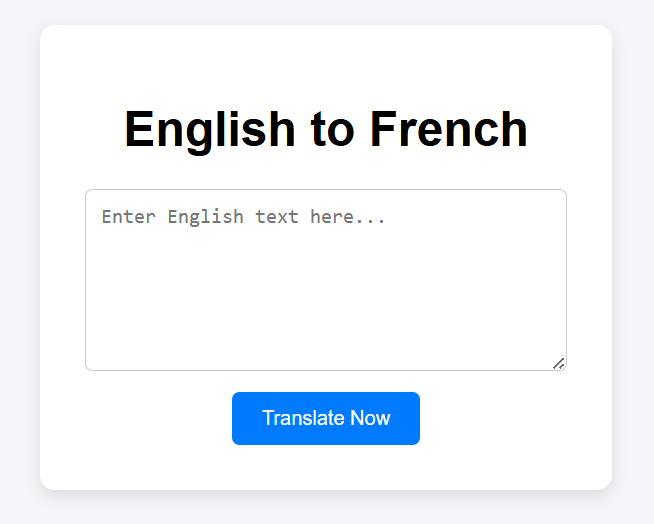

# English to French Machine Translation App
This project is a lightweight web application that uses a Deep Learning model (LSTM) to translate English text into French. It is built with **Flask**, **TensorFlow**, and **Keras**, and is fully containerized using **Docker** for easy deployment.

## ------ Model Dataset -----
The current model was trained on a limited dataset for demonstration purposes. While the deployment pipeline is fully functional, translation accuracy and quality can be improved with further training on a larger dataset.

## ----- Features ------
- **Neural Translation:** Uses a sequence-to-sequence model trained on English-French sentence.
- **Web Interface:** A simple, clean UI for users to input English text and receive instant translations.
- **Dockerized:** Ready to run on any machine without installing Python.

## ----- App Preview ------

## ----- Local Setup (Using Docker) -----
To run the translation on your own machine, follow these steps:

1. **Clone the repository:**
   git clone https://github.com/Salem9809/Machine-Translation-Model.git
   then promt the following command
   cd Machine-Translation-Model

2. --- Build Dokcer Image ---
   using the following commad to build docker image
   docker build -t translation-app .
3. --- Run the Container ---
   to run the container using the copy the following command
   docker run -p 5000:5000 translation-app

4. --- Access the App ---
Open your browser and go to http://localhost:5000.

## ----- How to Use ------
    1. Enter an English sentence into the text area.
    2. Click the "Translate Now" button.
    3. The French translation will appear below the form.

## ----- Issues & Limitations -----
**Translation Quality:** The model is trained on a small dataset, so it will produce repetitive or inaccurate words.
**Vocabulary:** Only words present in the training vocabulary will be translated correctly.